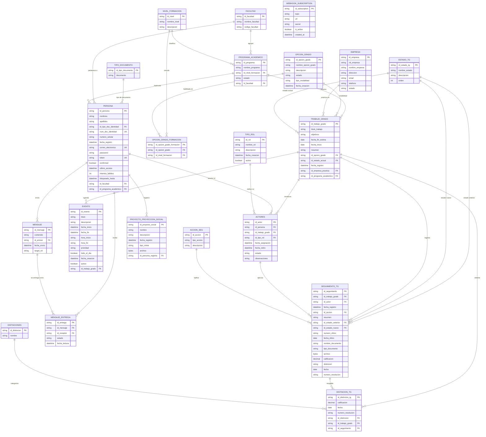

# Diagrama Entidad-Relación

Diagrama de la base de datos del sistema de trabajos de grado de UniMayor, generado a partir de `backend/prisma/schema.prisma`.

## Notas

- `WEBHOOK_SUBSCRIPTION` no tiene relaciones; es una tabla de configuración de webhooks.
- `SEGUIMIENTO_TG` tiene dos relaciones con `ESTADO_TG` (estado anterior y estado nuevo), modelando la transición de estados del trabajo de grado.
- `MENSAJE` y `MENSAJE_ENTREGA` implementan un patrón de mensajería 1-a-N: un mensaje se entrega a múltiples receptores con seguimiento de estado individual.
- `ACTORES` es la tabla pivote que conecta `PERSONA`, `TRABAJO_GRADO` y `TIPO_ROL`, registrando la participación temporal de cada persona en un trabajo de grado.
