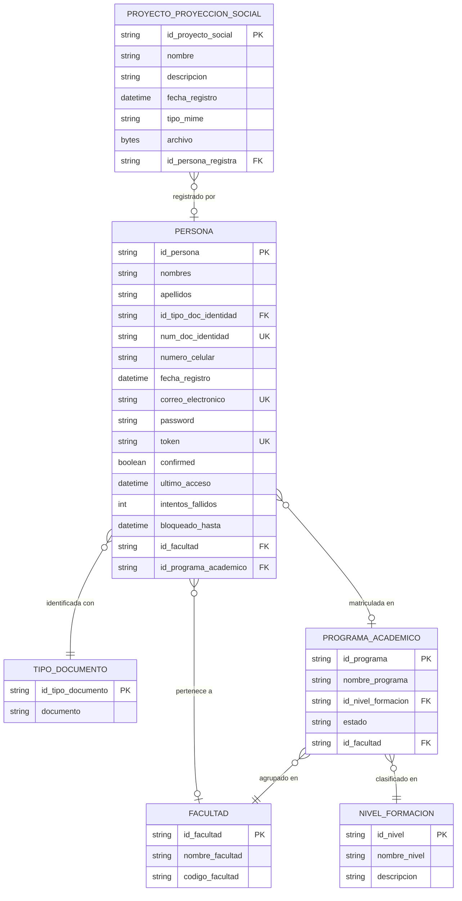

# Diagrama Entidad-Relación — Proyección Social

Subconjunto del modelo de datos correspondiente a Proyección Social y todas sus entidades relacionadas, extraído de `backend/prisma/schema.prisma`.

## Relaciones

| Origen | Destino | Cardinalidad | Campo FK | Obligatoria |
|--------|---------|--------------|----------|-------------|
| `PROYECTO_PROYECCION_SOCIAL` | `PERSONA` | N a 1 | `id_persona_registra` | No (nullable) |
| `PERSONA` | `TIPO_DOCUMENTO` | N a 1 | `id_tipo_doc_identidad` | Sí |
| `PERSONA` | `FACULTAD` | N a 1 | `id_facultad` | No (nullable) |
| `PERSONA` | `PROGRAMA_ACADEMICO` | N a 1 | `id_programa_academico` | No (nullable) |
| `PROGRAMA_ACADEMICO` | `FACULTAD` | N a 1 | `id_facultad` | Sí |
| `PROGRAMA_ACADEMICO` | `NIVEL_FORMACION` | N a 1 | `id_nivel_formacion` | Sí |

## Notas

- `PROYECTO_PROYECCION_SOCIAL.id_persona_registra` es **nullable**: un proyecto puede existir sin persona asociada al momento del registro.
- El archivo se almacena como `LongBlob` directamente en la base de datos junto con su `tipo_mime`.
- La entidad `PROYECTO_PROYECCION_SOCIAL` solo tiene relación directa con `PERSONA`. Las demás entidades (`TIPO_DOCUMENTO`, `FACULTAD`, `PROGRAMA_ACADEMICO`, `NIVEL_FORMACION`) están incluidas porque conforman el contexto académico-institucional que identifica a la persona que registra el proyecto.
- Índices definidos sobre `id_persona_registra` y `fecha_registro` para soportar consultas por autor y por orden cronológico.
